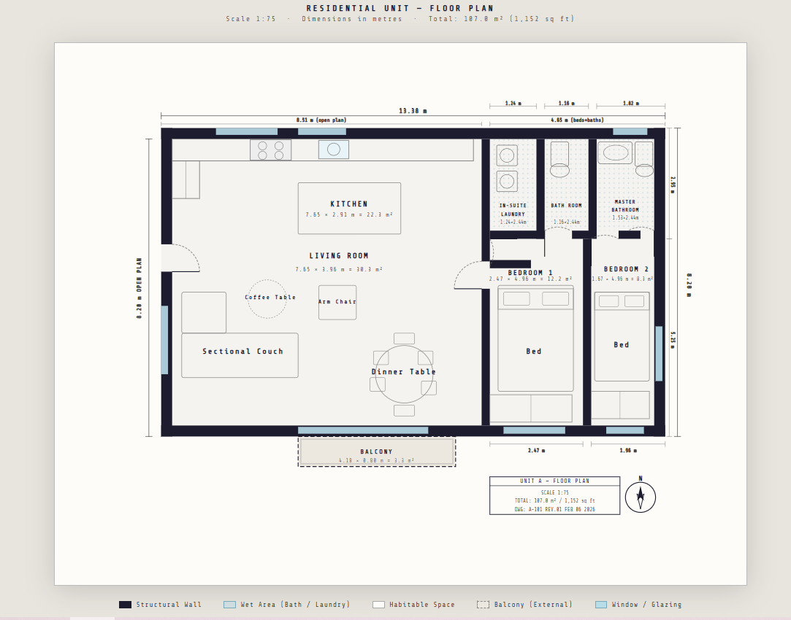

## Condo Floor Plan For an Assignment

This project contains a single-page SVG floor plan created as part of a **school assignment**.

- **Context**: conceptual two-bedroom condo layout with balcony and detailed room labelling.
- **Tech**: plain HTML + inline SVG, no build tools or frameworks.
- **Purpose**: demonstrate basic architectural drafting concepts (walls, doors, windows, dimensions) using web-friendly vector graphics.

Below is the rendered floor plan used for the assignment:

  

